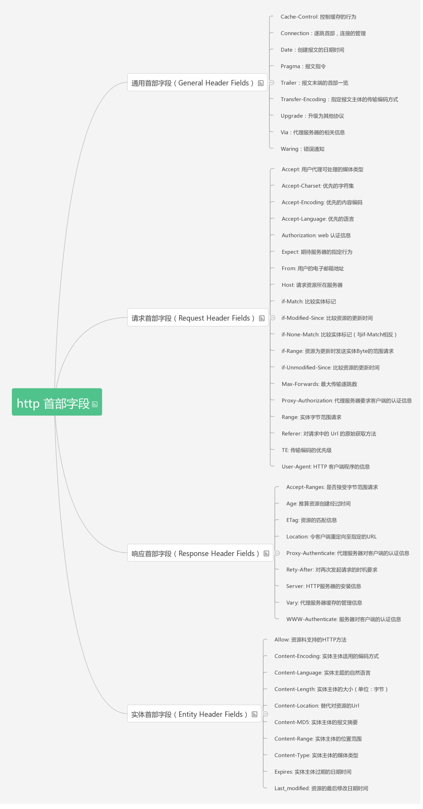
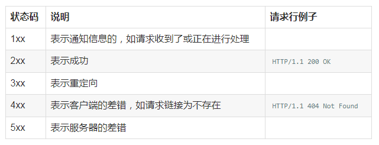

# HTTP

## 目录

- [session和cookie](#session和cookie)
- [长短轮询](#长短轮询)
- [基于HTTP的RESTFUL](#基于HTTP的RESTFUL)
- [TCP&IP](#TCP&IP)

## session和cookie

* 1.由于HTTP协议是无状态的协议，所以服务端需要记录用户的状态时，就需要用某种机制来识具体的用户，这个机制就是Session.典型的场景比如购物车，当你点击下单按钮时，由于HTTP协议无状态，所以并不知道是哪个用户操作的，所以服务端要为特定的用户创建了特定的Session，用用于标识这个用户，并且跟踪用户，这样才知道购物车里面有几本书。这个Session是保存在服务端的，有一个唯一标识。在服务端保存Session的方法很多，内存、数据库、文件都有。集群的时候也要考虑Session的转移，在大型的网站，一般会有专门的Session服务器集群，用来保存用户会话，这个时候 Session 信息都是放在内存的，使用一些缓存服务比如Memcached之类的来放 Session。

* 2.思考一下服务端如何识别特定的客户？这个时候Cookie就登场了。每次HTTP请求的时候，客户端都会发送相应的Cookie信息到服务端。实际上大多数的应用都是用 Cookie 来实现Session跟踪的，第一次创建Session的时候，服务端会在HTTP协议中告诉客户端，需要在 Cookie 里面记录一个Session ID，以后每次请求把这个会话ID发送到服务器，我就知道你是谁了。有人问，如果客户端的浏览器禁用了 Cookie 怎么办？一般这种情况下，会使用一种叫做URL重写的技术来进行会话跟踪，即每次HTTP交互，URL后面都会被附加上一个诸如 sid=xxxxx 这样的参数，服务端据此来识别用户。

* 3.Cookie其实还可以用在一些方便用户的场景下，设想你某次登陆过一个网站，下次登录的时候不想再次输入账号了，怎么办？这个信息可以写到Cookie里面，访问网站的时候，网站页面的脚本可以读取这个信息，就自动帮你把用户名给填了，能够方便一下用户。这也是Cookie名称的由来，给用户的一点甜头。

* 总结：

    * Session是在服务端保存的一个数据结构，用来跟踪用户的状态，这个数据可以保存在集群、数据库、文件中；
    
    * Cookie是客户端保存用户信息的一种机制，用来记录用户的一些信息，也是实现Session的一种方式。

## 长短轮询

* 1.我们如今使用的HTTP协议都是1.1的，因此我们平常用的都是长连接。这里要强调一下，HTTP协议是基于请求/响应模式的，因此只要服务端给了响应，本次HTTP连接就结束了，或者更准确的说，是本次HTTP请求就结束了，根本没有长连接这一说，那么自然也就没有短连接这一说了。

* 2.长短连接是基于TCP连接的，TCP才是真正的传输层协议，TCP连接才分长连接和短连接。

* 3.形象的例子：一个形象的例子就是，拿你在网上购物来说，HTTP协议是指的那个快递单，你寄件的时候填的单子就像是发了一个HTTP请求，等货物运到地方了，快递员会根据你发的请求把货物送给相应的收货人。而TCP协议就是中间运货的那个大货车，也可能是火车或者飞机，但不管是什么，它是负责运输的，因此必须要有路，不管是地上还是天上。那么这个路就是所谓的TCP连接，也就是一个双向的数据通道。

* 4.设置connection为keep alive 就算是长连接了

* 5.长连接的好处：那既然长连接是指的TCP连接，也就是说复用的是TCP连接。那这就很好解释了，也就是说，长连接情况下，多个HTTP请求可以复用同一个TCP连接，这就节省了很多TCP连接建立和断开的消耗。

* 6.长连接并不是永久连接的。如果一段时间内（具体的时间长短，是可以在header当中进行设置的，也就是所谓的超时时间），这个连接没有HTTP请求发出的话，那么这个长连接就会被断掉。

* 7.长连接并不是永久连接的。如果一段时间内（具体的时间长短，是可以在header当中进行设置的，也就是所谓的超时时间），这个连接没有HTTP请求发出的话，那么这个长连接就会被断掉。

* 8.短轮询就是客户端若不停的发起请求，服务端一旦收到请求就立即返回响应；而长轮询则是在客户端不停的发起请求时，服务端会把当前的请求挂起一段时间，这个时间也叫超时时间，在这个时间里，服务器会去响应的内容有没有变化，若检测到变化就立即返回响应，否则就一直等到超时为止。

* 9.长短轮询和长短连接的区别
    
    * 第一个区别是决定的方式，一个TCP连接是否为长连接，是通过设置HTTP的Connection Header来决定的，而且是需要两边都设置才有效。而一种轮询方式是否为长轮询，是根据服务端的处理方式来决定的，与客户端没有关系。
       
## 基于HTTP的RESTFUL

[参考资料](http://www.cnblogs.com/loveis715/p/4669091.html)

如果一个系统满足了下面所列出的五条约束，那么该系统就被称为是RESTful的。

* 使用客户/服务器模型。客户和服务器之间通过一个统一的接口来互相通讯。

* 层次化的系统。在一个REST系统中，客户端并不会固定地与一个服务器打交道。

* 无状态。在一个REST系统中，服务端并不会保存有关客户的任何状态。也就是说，客户端自身负责用户状态的维持，并在每次发送请求时都需要提供足够的信息。

* 可缓存。REST系统需要能够恰当地缓存请求，以尽量减少服务端和客户端之间的信息传输，以提高性能。

* 统一的接口。一个REST系统需要使用一个统一的接口来完成子系统之间以及服务与用户之间的交互。这使得REST系统中的各个子系统可以独自完成演化。

## TCP&IP

TCP/IP的理解首先要先理解 **TCP/IP五层模型的协议** 和 **OSI七层模型**。TCP对应的是传输层，IP对应的是网络层

* TCP和UDP
    
    * TCP(Transfer Control Protocol) 传输控制协议方式，该传输方式是一种稳定可靠的传送方式，类似于显示中的打电话。只需要建立一次连接，就可以多次传输数据。就像电话只需要拨一次号，就可以实现一直通话一样，如果你说的话不清楚，对方会要求你重复，保证传输的数据可靠。 使用该种方式的优点是稳定可靠，缺点是建立连接和维持连接的代价高，传输速度不快。
    
    * UDP(User Datagram Protocol) 用户数据报协议方式，该传输方式不建立稳定的连接，类似于发短信息。每次发送数据都直接发送。发送多条短信，就需要多次输入对方的号码。该传输方式不可靠，数据有可能收不到，系统只保证尽力发送。 使用该种方式的优点是开销小，传输速度快，缺点是数据有可能会丢失。
    
    * 在实际的网络编程中，大家可以根据需要选择任何一种传输方式，或组合使用这两种方式实现数据的传递。
    
* IP和端口

    * IP地址是一个规定，现在使用的是IPv4，既由4个0-255之间的数字组成，在计算机内部存储时只需要4个字节即可。在计算机中，IP地址是分配给网卡的，每个网卡有一个唯一的IP地址，如果一个计算机有多个网卡，则该台计算机则拥有多个不同的IP地址，在同一个网络内部，IP地址不能相同。IP地址的概念类似于电话号码、身份证这样的概念。由于IP地址不方便记忆，所以有专门创造了域名(Domain Name)的概念，其实就是给IP取一个字符的名字，例如163.com、sina.com等。IP和域名之间存在一定的对应关系。如果把IP地址类比成身份证号的话，那么域名就是你的姓名。
    
    * 其实在网络中只能使用IP地址进行数据传输，所以在传输以前，需要把域名转换为IP，这个由称作DNS的服务器专门来完成。 所以在网络编程中，可以使用IP或域名来标识网络上的一台设备。
    
    * 一台拥有IP地址的主机可以提供许多服务，比如Web服务、FTP服务、SMTP服务等，这些服务完全可以通过1个IP地址来实现。那么，主机是怎样区分不同的网络服务呢？显然不能只靠IP地址，因为IP 地址与网络服务的关系是一对多的关系。实际上是通过“IP地址+端口号”来区分不同的服务的。
    
    * 为了在一台设备上可以运行多个程序，人为的设计了端口(Port)的概念，类似的例子是公司内部的分机号码。规定一个设备有216个，也就是65536个端口，每个端口对应一个唯一的程序。每个网络程序，无论是客户端还是服务器端，都对应一个或多个特定的端口号。由于0-1024之间多被操作系统占用，所以实际编程时一般采用1024以后的端口号。
    
    * 使用端口号，可以找到一台设备上唯一的一个程序。  所以如果需要和某台计算机建立连接的话，只需要知道IP地址或域名即可，但是如果想和该台计算机上的某个程序交换数据的话，还必须知道该程序使用的端口号。
    
    * 下面是一些常见的服务对应的端口：ftp：23，telnet：23，smtp：25，dns：53，http：80，https：443
    
## 浏览器输入url之后的过程

### URL的理解

* 协议

* DNS域名

* 端口

* 资源

### 流程

## 报文的结构

* 开始行

	* 请求报文是由方法、URL、HTTP版本三个元素组成
	* GET /csrfToken HTTP/1.1
	* 相应报文是由HTTP版本、状态码两个元素组成
	* HTTP/1.1 200 OK      
	* HTTP/1.1 404 Not Found

* 首部行
	

	
* 实体主体

## 基本状态码

## HTTP缓存
