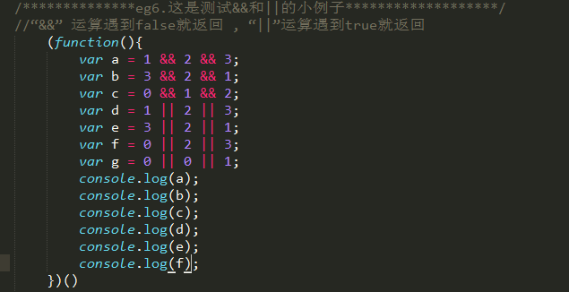

# JavaScript
[参考文档](https://developer.mozilla.org/zh-CN/docs/Web/JavaScript/Reference)
## 一、基础知识
### 1.undefined
* 变量被声明了，但没有赋值时，就等于undefined
* 调用函数时，应该提供的参数没有提供，该参数等于undefined
* 对象没有赋值的属性，该属性的值为undefined
* 函数没有返回值时，默认返回undefined

### 2.&&和||
*  "&&" 运算遇到false就返回 "||"运算遇到true就返回



### 3.词法作用域及闭包
* JS作用域
    * JS引擎：从头到尾负责整个Javascript程序的编译及执行过程
    * context
    
    
    * 编译器：分词/词法分析（词法单元）、解析/语法分析（抽象语法树AST）、代码生成（将AST转为机器指令）
    * 变量的赋值操作：首先编译器会在当前作用域中声明一个变量，然后在运行时引擎会在作用域中查找该变量，如果能够找到就会对他赋值
    * for
    
    
* 闭包记住两种情况，一个是函数当作值传递，一个是返回函数

### 4.this
* 默认绑定
* 隐式绑定
* 显示绑定
* new绑定

### 5.理解异步编程

[http://www.ruanyifeng.com/blog/2012/12/asynchronous%EF%BC%BFjavascript.html](http://www.ruanyifeng.com/blog/2012/12/asynchronous%EF%BC%BFjavascript.html) 
[http://developer.51cto.com/art/201609/516971.htm](http://developer.51cto.com/art/201609/516971.htm)
[https://segmentfault.com/a/1190000002999668](https://segmentfault.com/a/1190000002999668)

## 二、事件
### 1. onresize()
* onresize 事件会在窗口或框架被调整大小时发生。

### 2.oncontextmenu()
* oncontextmenu 事件在元素中用户右击鼠标时触发并打开上下文菜单。
* 例：<div oncontextmenu="myFunction()" contextmenu="mymenu">

### 3.事件可绑定多个函数
* 例如：onclick=“a();b();c()”,绑定的函数按顺序执行

## 三、方法
### 1. Window.open()
* open() 方法用于打开一个新的浏览器窗口或查找一个已命名的窗口
* window.open(URL,name,features,replace)
* 注：open()中的入参代表意思以及窗口的一些属性配置（比如大小、位置）需详查W3C。另，窗口的属性可以在入参features中进行配置

### 2.pop()
* pop() 方法用于删除并返回数组的最后一个元素
* arrayObject.pop()
* pop() 方法将删除 arrayObject 的最后一个元素，把数组长度减 1，并且返回它删除的元素的值。如果数组已经为空，则 pop() 不改变数组，并返回 undefined 值

### 3.shift()
* shift() 方法用于删除并返回数组的第一个元素
* arrayObject.shift()
* shift() 方法将删除 arrayObject 的第一个元素，把数组长度减 1，并且返回它删除的元素的值。如果数组已经为空，则 shift() 不改变数组，并返回 undefined 值

### 4.exec()
* exec() 方法用于检索字符串中的正则表达式的匹配。
* RegExpObject.exec(string)
* 返回一个数组，其中存放匹配的结果。如果未找到匹配，则返回值为 null

### 5.instanceof()
* 在 JavaScript 中，判断一个变量的类型尝尝会用 typeof 运算符，在使用 typeof 运算符时采用引用类型存储值会出现一个问题，无论引用的是什么类型的对象，它都返回 “object”。这就需要用到instanceof来检测某个对象是不是另一个对象的实例。
另外，更重的一点是 instanceof 可以在继承关系中用来判断一个实例是否属于它的父类型。<br>例如：
```javascript
function Foo(){} 
Foo.prototype = new Aoo();//JavaScript 原型继承 
var foo = new Foo(); 
console.log(foo instanceof Foo)//true 
console.log(foo instanceof Aoo)//true
```

* 在多层继承关系中，instanceof 运算符同样适用
```javascript
console.log(Object instanceof Object);//true 
console.log(Function instanceof Function);//true 
console.log(Number instanceof Number);//false 
console.log(String instanceof String);//false 
console.log(Function instanceof Object);//true 
console.log(Foo instanceof Function);//true 
console.log(Foo instanceof Foo);//false
```
### 6.slice()
* slice() 方法可从已有的数组中返回选定的元素
* arrayObject.slice(start,end)

### 7.hasOwnProperty()
* 语法：object.hasOwnProperty(proName)
* hasOwnProperty() 方法用来判断某个对象是否含指定的自身属性。所继承了 Object.prototype 的对象都会从原型链上继承到 hasOwnProperty 方法，这个方法可以用来检测一个对象是否含有特定的自身属性，和in运算符不同，该方法会忽略掉那些从原型链上继承到的属性。
* 返回值：true/false

### 8.location()

<table>
    <th>
        <td>属性</td>
        <td>描述</td>
    </th>
    <tr>
        <td>hash</td>
        <td>设置或返回从井号 (#) 开始的 URL（锚）</td>
    </tr>
    <tr>
        <td>host</td>
        <td>设置或返回主机名和当前 URL 的端口号</td>
    </tr>
    <tr>
        <td>hostname</td>
        <td>设置或返回当前 URL 的主机名</td>
    </tr>
    <tr>
        <td>href</td>
        <td>设置或返回完整的 URL</td>
    </tr>
    <tr>
        <td>port</td>
        <td>设置或返回当前 URL 的端口号</td>
    </tr>
    <tr>
        <td>pathname</td>
        <td>设置或返回当前 URL 的路径部分</td>
    </tr>
    <tr>
        <td>protocol</td>
        <td>设置或返回当前 URL 的协议</td>
    </tr>
    <tr>
        <td>search</td>
        <td>设置或返回从问号 (?) 开始的 URL（查询部分）</td>
    </tr>
</table>

### 9.substr()
* stringObject.substr(start,length)
* substr() 方法可在字符串中抽取从 start 下标开始的指定数目的字符

### 10.indexOf()
* stringObject.indexOf(searchvalue,fromindex)
* indexOf() 方法可返回某个指定的字符串值在字符串中首次出现的位置
* 注释：如果要检索的字符串值没出现，则该方法返回 -1

### 11.split()
* stringObject.split(separator,howmany)
* split() 方法用于把一个字符串分割成字符串数组

### 12.replace()
* replace() 方法用于在字符串中用一些字符替换另一些字符，或替换一个与正则表达式匹配的子串。
* stringObject.replace(regexp/substr,replacement)
* 例：
```javascript
<script type="text/javascript">
var str="Visit Microsoft!"
document.write(str.replace(/Microsoft/, "W3School"))
</script>
```

### 13.appendChild()
* appendChild() 方法向节点添加最后一个子节点
* 例：document.getElementById("myList").appendChild(newListItem)
### 14.map()
* map() 方法返回一个由原数组中的每个元素调用一个指定方法后的返回值组成的新数组。
* map 方法会给原数组中的每个元素都顺序调用一次 callback 函数。callback 每次执行后的返回值（包括undefined组合起来形成一个新数组。 callback 函数只会在有值的索引上被调用；那些从来没被赋过值或者使用 delete 删除的索引则不会被调用。
* array.map(callback[, thisArg])
* 例：
```javascript
var numbers = [1, 4, 9];
var roots = numbers.map(Math.sqrt);
//roots的值为[1, 2, 3], numbers的值仍为[1, 4, 9]
```
### 15.join()
* 所的数组元素被转换成字符串，再用一个分隔符将这些字符串连接起来。如果元素是undefined 或者null， 则会转化成空字符串
* 例
```javascript
var a = ['Wind', 'Rain', 'Fire'];
var myVar1 = a.join();      // myVar1的值变为"Wind,Rain,Fire"
var myVar2 = a.join(', ');  // myVar2的值变为"Wind, Rain, Fire"
var myVar3 = a.join(' + '); // myVar3的值变为"Wind + Rain + Fire"
var myVar4 = a.join('');    // myVar4的值变为"WindRainFire"
```
### 16.JSON.parse(str)
*将Json字符串转化为JS对象,下面的data_json已经是一个Json对象了
```javascript
data_json = JSON.parse(data);
```
### 17.JSON.stringfy(data_json)
* 将Json对象转化为字符串
