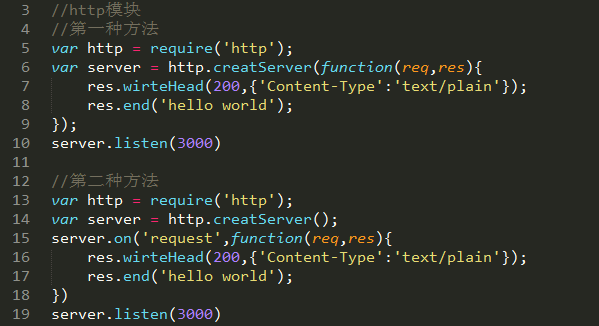
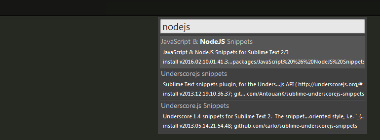
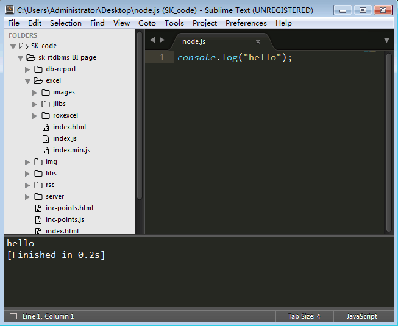

# Node.js
## 一、基础知识
### 1. node.js之模块

* require 模块<br>
通过Node.js的官方API可以看到Node.js本身提供了很多核心模块 [http://nodejs.org/api/](http://nodejs.org/api/), 这些核心模块被编译成二进制文件，可以require('模块名')去获取；核心模块具有最高的加载优先级（有模块与核心模块同名时会体现）。
<br>
Node.js还有一类模块为文件模块，可以是JavaScript代码文件（.js作为文件后缀）、也可以是JSON格式文本文件（.json作为文件后缀）、还可以是编辑过的C/C++文件（.node作为文件后缀）；文件模块访问方式通过require('/文件名.后缀')、require('./文件名.后缀')、requrie('../文件名.后缀') 去访问，文件后缀可以省略；以"/"开头是以绝对路径去加载，以"./"开头和以"../"开头表示以相对路径加载，而以"./"开头表示同级目录下文件，前面提到文件后缀可以省略，Nodejs尝试加载的优先级 js文件 > json文件 > node文件。
<br>
自定义模块方式是通过**exports**和**module.exports**来自行定义，然后再通过上述方法引用。<br>


* events 模块<br>

* http 模块<br>
http常用的方法为：<br>


* file system 模块<br>

## 二、环境配置
### 1. node.js下载及安装
* node.js下载网址<br>
在该网址下下载对应的node.js文件 [https://nodejs.org/en/download/]（https://nodejs.org/en/download/）
<br>
在命令行中输入 node --version 来检测是否安装node

* sublime text 3 安装Nodejs插件<br>
Preferences——>package controll——>install package——>搜索nodejs<br>


### 2. Sublime Node.js开发环境配置
运行Sublime,菜单上找到Tools ——> Build System ——> new Build System
文件中输入<br>
```javascript
{
	"cmd": ["node", "$file"],
	"file_regex": "^[ ]*File \"(...*?)\", line ([0-9]*)",
	"selector": "source.javascript"
}
```
保存文件为NodeJs.sublime-build
<br>
菜单上找到Tools ---> Build System --->选择 NodeJs
<br>
菜单上找到preference --->package settings--->Nodejs--->setting-default 打开文件并 更改成以下代码：
```javascript
// save before running commands
  "save_first": true,
  // if present, use this command instead of plain "node"
  // e.g. "/usr/bin/node" or "C:\bin\node.exe"
  "node_command": "D:\\nodejs\\node.exe",
  // Same for NPM command
  "npm_command": "D:\\nodejs\\npm.cmd",
  // as 'NODE_PATH' environment variable for node runtime
  "node_path": true,
  "expert_mode": false,
  "ouput_to_new_tab": false
}
```
主要是**"node_command"**和**"npm_command"**，应找到安装nodejs时路径下对应的文件。<br>
关闭重启sublime text 3，测试环境配置：
Ctrl+B，应该出现下图<br>

## 三、node.js与Mysql的交互
## 四、node.js与MongoDB的交互
## 五、node.js与Redis交互
