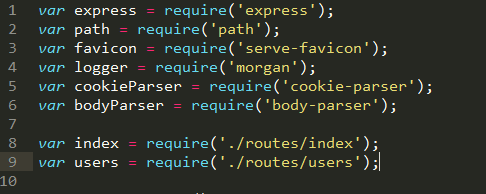
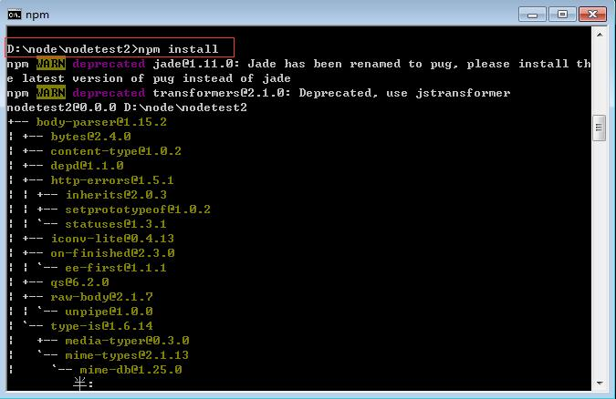
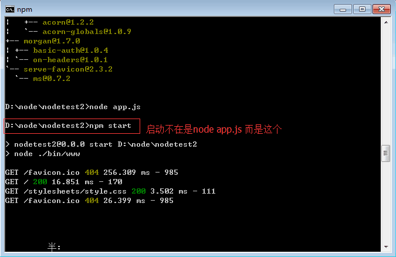
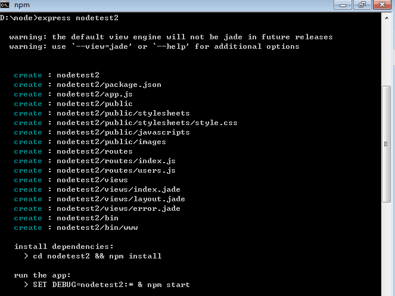
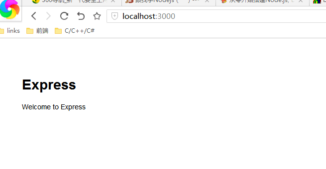
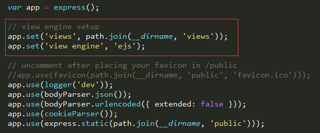

# Node.js
## 一、基础知识
### 1. node.js之模块

* require 模块

    * 通过Node.js的官方API可以看到Node.js本身提供了很多核心模块 [http://nodejs.org/api/](http://nodejs.org/api/), 这些核心模块被编译成二进制文件，可以require('模块名')去获取；核心模块具有最高的加载优先级（有模块与核心模块同名时会体现）。
    
    * Node.js还有一类模块为文件模块，可以是JavaScript代码文件（.js作为文件后缀）、也可以是JSON格式文本文件（.json作为文件后缀）、还可以是编辑过的C/C++文件（.node作为文件后缀）；文件模块访问方式通过require('/文件名.后缀')、require('./文件名.后缀')、requrie('../文件名.后缀') 去访问，文件后缀可以省略；以"/"开头是以绝对路径去加载，以"./"开头和以"../"开头表示以相对路径加载，而以"./"开头表示同级目录下文件，前面提到文件后缀可以省略，Nodejs尝试加载的优先级 js文件 > json文件 > node文件。
    
    * 自定义模块方式是通过**exports**和**module.exports**来自行定义，然后再通过上述方法引用。
    


* events 模块

* http 模块

    * http常用的方法为:<br> 
    


* file system 模块

## 二、环境配置
### 1. node.js下载及安装
* node.js下载网址

    * 在该网址下下载对应的node.js文件 [https://nodejs.org/en/download/](https://nodejs.org/en/download/)
    
    * 在命令行中输入 node --version 来检测是否安装node
    
* sublime text 3 安装Nodejs插件

    * Preferences——>package controll——>install package——>搜索nodejs<br>
    


### 2. Sublime Node.js开发环境配置
* 运行Sublime,菜单上找到Tools ——> Build System ——> new Build System

* 文件中输入以下代码，并另存文件为NodeJs.sublime-build

```javascript
{
	"cmd": ["node", "$file"],
	"file_regex": "^[ ]*File \"(...*?)\", line ([0-9]*)",
	"selector": "source.javascript"
}
```

* 菜单上找到Tools ---> Build System --->选择 NodeJs

* 菜单上找到preference --->package settings--->Nodejs--->setting-default 打开文件并 更改成以下代码，主要是**"node_command"**和**"npm_command"**，应找到安装nodejs时路径下对应的文件。

```javascript
// save before running commands
  "save_first": true,
  // if present, use this command instead of plain "node"
  // e.g. "/usr/bin/node" or "C:\bin\node.exe"
  "node_command": "D:\\nodejs\\node.exe",
  // Same for NPM command
  "npm_command": "D:\\nodejs\\npm.cmd",
  // as 'NODE_PATH' environment variable for node runtime
  "node_path": true,
  "expert_mode": false,
  "ouput_to_new_tab": false
}
```

* 关闭重启sublime text 3，测试环境配置。Ctrl+B，应该出现下图


### 3. 安装express框架
* 打开客户端，输入命令“npm install express -g”<br>


* 安装完后，继续输入命令安装express的命令工具“npm install -g express-generator” 


### 4. 创建express项目
* 新建一个目录，客户端进入该目录

* 输入命令“express  nodetest2"，创建了一个express项目，项目名称为nodetest2


在生成的package.json中增添依赖的模块

* 安装依赖


* 测试（*这里也可以直接用sublime打开app.js，然后ctrl+B运行程序*）


* 在浏览器中可以访问 http://localhost:3000/


### 5. 将默认的ejs/jade模板更改为nunjucks
* 原来的模板设置为<br>


* 现在需要在package.json中添加nunjucks依赖后，在app.js文件中的相应代码做如下修改


## 三、node.js与Mysql的交互
## 四、node.js与MongoDB的交互
## 五、node.js与Redis交互
