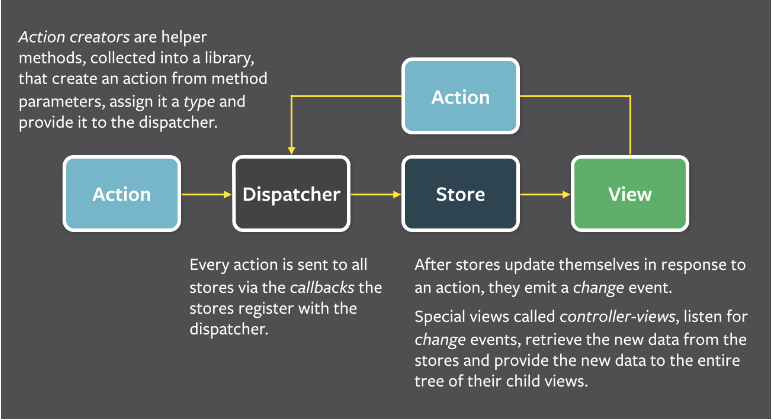

# React Flux React-Router Redux

## 目录

- React
  - [component](#component)
  - [props](#props)
  - [state](#state)
  - [lifecircle](#lifecircle)
  - [其他](#其他)
  
- Flux
  - [核心思想](#核心思想)
  - [解决的问题和优缺点](#解决的问题和优缺点)
  - [项目构建的文档结构](#项目构建的文档结构)
  - [dispatcher](#dispatcher)
  - [action](#action)
  - [store](#store)
  - [view](#view)
  
- React-Router

- Redux
  - [action](#action)
  - [store](#store)
  - [reducer](#reducer)
  - [connect](#connect)
  
## React

### component

React 的核心思想是组件式和虚拟Dom，每个页面分割成多个组价组成，每个组件可以多次复用，其注意要点如下：

* 每个页面存在一个父组件，一般为app.js或index.js，主要是将jsx渲染到html中，核心代码为

```javascript
ReactDOM.render(
  <Parent />,
  document.getElementById('app')
);
```

* 组件的声明创建一般通过es6的class，继承React.Component,首字母大写

```javascript
class ComponentA extends React.Component {
  constructor(props) {
	super(props);
	this.state = {
	  value1:'',
	  value2:'',
	  ...
	}
  };
  
  //这里添加需要的方法
  
  //最后调用react内置的render()方法进行渲染
  render() {
    return({
	  ...
    })
  };
 
}
```

* 组件的引用react一般是通过jsx的方式,与声明的组件类名称一致

```javascript
render() {
  return (
    <div>
      <ComponentA />
	  <ComponentB />
	  ...
	</div>
  )
}
```

### props

* props实现了组件之间的通信，一般设置静态的属性

* props需要利用es6的class特性，在class函数的constructor中调用super(props)，其作用是来新建父类的this对象，它会调用父类即React.Component的constructor

* 在一个class组件内，this.props代表的是引用组件时候的这个组件的属性对象(this代表该组件)，可以通过this.props来引用具体的属性， 下面的例子在span标签中就会显示bran

```javascript
//step1:class ComponentA中
//...

  render() {
    return({
	  <span>{this.props.name}</span>
    })
  };
  
//...

//step2:引用ComponentA时
//...
render() {
  return (
    <div>
      <ComponentA name='bran'/>
	  ...
	</div>
  )
}
//...
```

### state

* state一般是来设置页面动态的属性，比如页面时钟，实时更新搜索内容等

* 在规划属性时需要判断是用props还是用state，发现某个属性为静态时就用props，若是动态且交互性较强就用state

* state就是一个json，里面添加变动的属性，state在class组件的constructor中添加，和props一样

* 在设置动态属性变动的时候在封装的函数内调用setState方法，入参为一个json，包含特定需要改变的属性即可(不需要全部添加)，一般需要this.setState({value1:changing})

### lifecircle

* 组件初始化

    * getDefaultProps
	    
		* 只会在装载之前调用一次，在组件中赋值的数据会被设置到this.props中 
	
	* getInitialState
	
	    * 只会在装载之前调用一次，这个函数的返回值会被设置到this.state中
	
	* componentWillMount
	
	    * 在render之前被调用，可以在渲染之前做一些准备工作
	
	* render
	
	* componentDidMount
	
	    * 只会在装载完成之后调用一次，如果想让组件加载完毕后做一些额外的操作，可以在这个方法中添加相应的代码

* 组件props更新

    * componentWillReceiveProps
	
	* shouldComponentUpdate
	
	* componentWillUpdate
	
	* render
	
	* componentDidUpdate

* 组件卸载

    * componentWillUnmount
	
	    * 在组件被卸载和销毁之前调用的方法，可以在这里做一些清理的工作

### 其他

## Flux

### 核心思想



Flux 的最大特点，就是数据的"单向流动"。任何相邻的部分都不会发生数据的"双向流动"。所有的状态都由 Store 来维护，通过 Action 传递数据。流程如下：

* 首先要有 action，通过定义一些 action creator 方法根据需要创建 Action 提供给 dispatcher

* View 层通过用户交互（比如 onClick）会触发 Action

* Dispatcher 会分发触发的 Action 给所有注册的 Store 的回调函数

* Store 回调函数根据接收的 Action 更新自身数据之后会触发一个 change 事件通知 View 数据更改了

* View 会监听这个 change 事件，拿到对应的新数据并调用 setState 更新组件 UI


### 解决的问题和优缺点

* 解决的问题

    * React的核心是组件，而且它负责的就是view的处理。但是当应用的复杂程度增加的时候，最上层组件中的state就会变得越来越复杂，单纯的只用React来开发会变得相当复杂和困难。
    
* 优缺点及适用条件

    * Flux会增加代码量，额外的引入了大量的概念和文件。
    
    * Flux会带来清晰的数据流，并且把数据和组件的state分离，保持了清晰的逻辑，避免了多向数据流动带来的混乱和维护困难问题。
    
    * Flux适用于比较复杂的多人项目，有较多的数据变动及交互的项目。不适合全部都是静态组件，且组件之间没有共享数据的项目。

### 项目构建的文档结构

#### 项目构建时的文档结构可以按照Flux中的四个核心概念来组织

* components/
    * view层的模板
* actions/
    * TodoAction.js
* dispatcher/
    * AppDispatcher.js
* stores/
    * TodoStore.js

### dispatcher

* 一般情况下是 new 一个 Dispatcher 对象并输出。Dispatcher 是flux内置的模块，由facebook官方实现。通过它来串联其他的部分

```javascript
import { Dispatcher } from 'flux';
export default new Dispatcher();
```

### action

* 每个Action都是一个对象，通过定义一些 action creator 方法来组成。这些action creator方法都**封装了AppDispatcher对象的dispatch()方法**，dispatch()的入参是一个对象，包含一个actionType属性（说明动作的类型）和一些其他属性（用来传递数据）。Action中的 action creator 方法暴露给外部调用（View层的用户交互触发，或服务端接口调用来创建动作,），通过 dispatcher 分发对应的动作。

```javascript
import AppDispatcher from './dispatcher/AppDispatcher';

const TodoAction = {
  create(todo) {
    AppDispatcher.dispatch({
      actionType: 'CREATE_TODO',
      todo,
      text,
      value
    });
  },

  delete(id) {
    AppDispatcher.dispatch({
      actionType: 'DELETE_TODO',
      id,
      name,
      menu
    })
  }
}
```


### store

[参考资料](https://hulufei.gitbooks.io/react-tutorial/content/flux.html)

* Store是单例模式，整个程序中每种store仅有一个实例。主要分两个部分，一个对象，一个函数调用AppDispatcher.register()

    * 创建一个todoStore对象，其包含需要处理的数据和方法(其实是第二部分的回调函数)，这一部分是为了第二部分做准备的，方便方法调用。这里运用了Object.assign和node.js中的EventEmitter,让todoStore继承EventEmitter.prototype，因此就能使用on和emit等方法来监听和触发事件。
    
    * 调用Dispatcher的register()方法，它可以注册不同事件的处理回调，并且在回调中对store进行处理。主要就是一个switch。

```javascript
//第一部分 TodoStore 对象
import AppDispatcher from './dispatcher/AppDispatcher';
import { EventEmitter } from 'event';

const TodoStore = assign({}, EventEmitter.prototype, {
  _todos: [];  //这里数组和json都可以，只是一个存放数据的容器
  
  // Getter 方法暴露给外部获取 Store 数据
  getAll: function() {
    return _todos;
  },
  
  // 暴露给外部处理 Store 数据的方法
  addTodo(todo) {
    this.todos.push(todo);
  }
  
  // 触发 change 事件
  emitChange: function() {
    this.emit('change');
  },
  
  // 提供给外部 View 绑定 change 事件
  addChangeListener: function(callback) {
    this.on('change', callback);
  }
  
  removeChangeListener: function() {
    this.remove('change', callback);
  }
});

//第二部分调用register()方法
AppDispatcher.register(function(action) {
  var text;
  switch(action.actionType) {
    case TODO_CREATE:
      TodoStore.addTodo(action.todo);
      TodoStore.emitChange();
      break;
    case DELETE_TODO:
      TodoStore.deleteTodo(action.id);
      TodoStore.emitChange();
      break;
  }
});
```

### view

view即React中的组件，在引用了flux后组件部分就要进行一定的改造（主要是最上层组件，因为一般只有最上层组件才会用到state）

* 将store中的数据存储到组件的state属性中

```javascript
  constructor(props) {
    super(props);
    //获取store存放的所有的数据，将其赋值给state
    this.state = {
      todos: TodoStore.getAll();
    }
    //这里的bind(this)是es6中的写法
    this.createTodo = this.createTodo.bind(this);
    this.deleteTodo = this.deleteTodo.bind(this);
    //onChange事件绑定声明的onChange方法
    this.onChange = this.onChange.bind(this);
  }
```

* 声明 componentDidMount 方法

```javascript
  componentDidMount() {
    //初始化的时候在store中注册这个事件
    TodoStore.addChangeListener(this.onChange);
  }
```
* 声明 componentWillUnmount 方法

```javascript
  componentWillUnmount() {
    //组件卸载的时候记得要清除这个事件绑定
    TodoStore.removeChangeListener(this.onChange);
  }
```

* 声明 onChange 方法

```javascript
  onChange() {
    //store 改变后触发的回调，用setState来更新整个UI
    this.setState({
      todos: TodoStore.getAll()
    })
  }
```

* 声明其他需要的一些方法

* render()

```javascript
  render() {
    return (
      <div>
        <List items={this.state.todos} onDelete={this.deleteTodo} />
        <CreateButton onClick={this.createTodo} />
      </div>
    )
  }
```

## Redux

### action

* actions都是一些对象,有type和想传递的属性值,一般用actionCreator来进行创建,其实就是一个方法返回action对象

### reducer

* reducer为一个纯函数，将state和action进行一个对应

* 在使用reducer的时候多联想Array.prototype.reduce()

* 在写reducer的时候千万记住是不能改state的

* reducer结构以一个switch为主

* reducer可能有很多，最后将他们都合并成一个

### store

* const store = createStore(reducer);

* store.subscribe()

* store.dispatch()

* 创建了store后每分发一个action，相应的state就会发生变化

### connect

* mapStateToProps

* mapDispatchToProps

* mergeProps

* 所有的组件都包含中<Provider>中

* Provider 内的任何一个组件，如果需要使用 state 中的数据，就必须是「被 connect 过的」组件——使用 connect 方法对「你编写的组件（MyComp）」进行包装后的产物。

