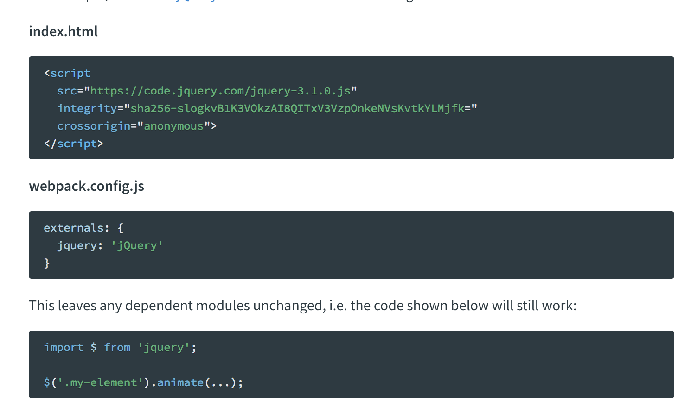

# WEBPACK

[参考文档](https://webpack.js.org/api/)
 
## 目录

- [vue中涉及到的Webpack知识点](#vue中涉及到的Webpack知识点)

## vue中涉及到的Webpack知识点

### 1. webpack中的Node API

* webpack()
	* webpack({}, callback),两个参数，第一个是webpack configuration对象，后面一个是回调函数
	* webpack({}, callback)如果没有callback，则会返回一个compiler instance，一般使用方式是  const compiler = webpack(configuration)
	
* compiler instance

* 配合express中的 app.use()

	* app.use([path,] callback [, callback...])
	* path 符合要求就触发回调函数，如果没有path则立即调用

* webpack Dev Middleware

### 2. 如何在vue和react等单页面中引入第三方js

1. 首先在html中引入需要引入的第三方js
2. 恰当的运用webpack的externals属性
3. 在需要引入的组件内引入该第三方组件，通过import 引入
4. 该组件内就可以直接使用了


#### webpack 原理
- webpack 中的 module 系统原理

webpack 在打包过程中会模拟一个模块系统，打包后的 js 是一个匿名立即执行函数, 匿名函数的入参是一个数组，数组内只有一个函数，表示内部模块代码，我们写的代码都在这一个函数中
```javascript
(function (modules) {/* 省略函数内容 */})
([
function (module, _webpack_exports_, __webpack_require__) {
  /* 我们写的代码 */，全部都在这一个函数中
}
]);
```
- webpack模块原理的调用逻辑

匿名函数最后返回 __webpack_require__(0) => module = {i:0,l:false,exports:{}} => modules[0].call({}, module, {}, __webpack_require__) => 
__webpack_require__.r({})

- 匿名函数内部声明了 __webpack_require__ 

改函数传入的是模块的id，在该函数内执行call对应的模块代码时注意传入的三个参数，新建的 module, module.exports, 内部的 __webpack_require__ 函数
```javascript
function __webpack_require__(moduleId) {

	// Check if module is in cache  确认module是否进行了缓存
	if(installedModules[moduleId]) {
		return installedModules[moduleId].exports;
	}
	// Create a new module (and put it into the cache)  新建一个module并添加到缓存内
	var module = installedModules[moduleId] = {
		i: moduleId,
		l: false,
		exports: {}
 	};
	// Execute the module function  调用模块函数
	modules[moduleId].call(module.exports, module, module.exports, __webpack_require__);

	// Flag the module as loaded  标记模块为已加载
	module.l = true;

	// Return the exports of the module 返回module.exports
 	return module.exports;
}
```
- 匿名函数的其他代码

匿名函数有最后返回了 moduleId = 0 的模块代码
```javascript
return __webpack_require__(__webpack_require__.s = 0);
```
- 模块函数

```javascript
function(module, __webpack_exports__, __webpack_require__) {
	"use strict";
	__webpack_require__.r(__webpack_exports__);

	// CONCATENATED MODULE: ./src/world.js
	console.log('module2')
	/* harmony default export */ var world = ({
	  world: 'world'
	});

	// CONCATENATED MODULE: ./src/hello.js

	var helloWorld= 'hello' + world.world
	console.log('module1')
	/* harmony default export */ var hello = ({
	  hello: helloWorld
	});

	// CONCATENATED MODULE: ./src/index.js

	console.log(hello.hello)
}
```
